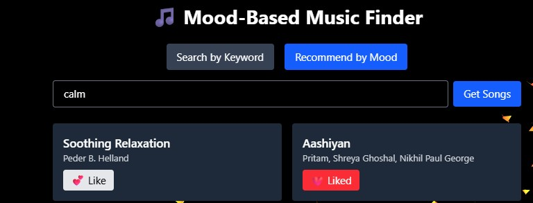
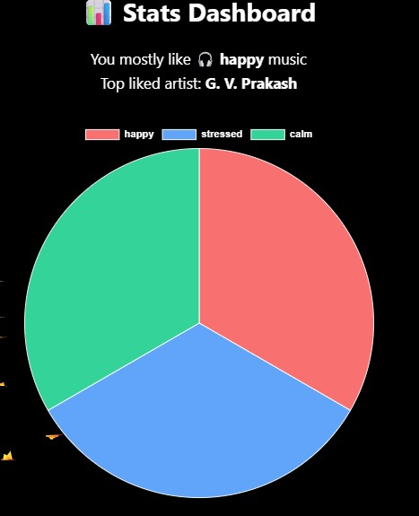

<!-- Homepage Full Width -->

  

# 🎵 RythmRecommender – AI-Powered Music Recommendation System

**RythmRecommender** is a full-stack AI-powered web application that delivers **personalized music recommendations** based on user mood and search queries.  
It combines **real-time mood analysis** with Spotify's Web API to suggest relevant tracks, leveraging artificial intelligence to enhance user experience.

---

## 🚀 Features

- 🔍 **Search Songs & Artists** using keywords  
- 🎧 **Mood-Based Music Recommendations** powered by AI  
- ❤️ **Like Songs** and save preferences  
- 🔐 **JWT Authentication** and **Google Sign-In** for secure and flexible login options  
- 📈 **Dynamic UI** built with Tailwind CSS & React  
- 📊 **Visual Analytics with Charts.js** to display user mood and genre preferences  
- 🎵 **Spotify Web API** for accurate and diverse music metadata  
- 🤖 **AI Integration** for mood-based classification  

---

## 🤖 AI Integration

- **Use Case:** Detects mood from user input (e.g., `"stressed"`, `"happy"`) and recommends tracks accordingly.  
- **Model Used:** `facebook/bart-large-mnli` – a zero-shot classification model by Meta AI  
- **How It Works:**  
  The model uses **Natural Language Inference (NLI)** to classify mood-related text into emotion labels.  
  These labels are used to fetch relevant songs via the **Spotify Web API**.

  

  
   

---

## 📊 Stats & Visualization

- The application integrates **React.js Chart libraries** (Chart.js via `react-chartjs-2`) to dynamically visualize user listening behavior.
- **Pie charts** show the distribution of moods (e.g., happy, calm, stressed) and genres that the user most frequently listens to.
- **Purpose:** Helps users understand their music taste trends and allows the system to further personalize future recommendations based on mood and genre history.

  

---

## 🛠 Tech Stack

**Frontend:**  
- React.js  
- Tailwind CSS  
- Chart.js (`react-chartjs-2`) for data visualization

**Backend:**  
- Node.js  
- Express.js  

**Authentication:**  
- JWT (JSON Web Tokens)  
- Google OAuth (Sign in with Google)

**Database:**  
- MongoDB Atlas (via **Prisma ORM**)

**External APIs:**  
- Spotify Web API  
- Hugging Face Inference API  

---

