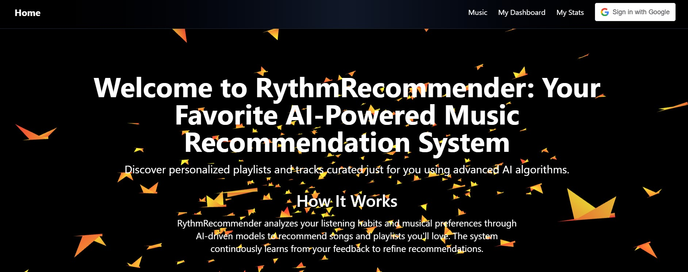


🎵 RythmRecommender – AI-Powered Music Recommendation System
RythmRecommender is a full-stack website that delivers personalized music recommendations based on user mood and search queries. It combines real-time mood analysis with Spotify's Web API to suggest relevant tracks, leveraging AI to enhance user experience.

🚀 Features:

🔍 Search Songs & Artists using keywords

🎧 Mood-Based Music Recommendations powered by AI

❤️ Like Songs and save preferences

🔐 JWT Authentication for user sessions

📈 Dynamic UI with Tailwind CSS & React

🎵 Spotify Web API for accurate music data

🤖 AI Integration

AI Use Case: Detects mood from user input (e.g. "stressed", "happy") and recommends tracks accordingly.

Model Used: facebook/bart-large-mnli – a zero-shot classification model by Meta AI.

How it Works: The model classifies mood-related input using natural language inference (NLI) to infer emotion labels, which are then used to fetch relevant songs via the Spotify Web API.

🛠 Tech Stack

Frontend: React.js, Tailwind CSS

Backend: Node.js, Express.js

Authentication: JWT (JSON Web Tokens)

Database: MongoDB Atlas

External APIs: Spotify Web API, Hugging Face Inference API
